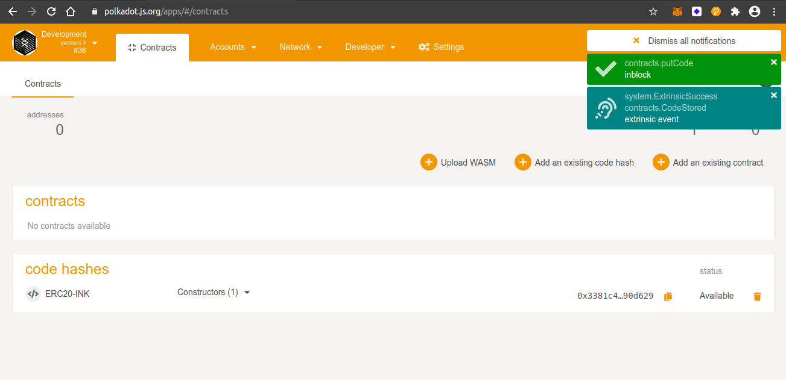
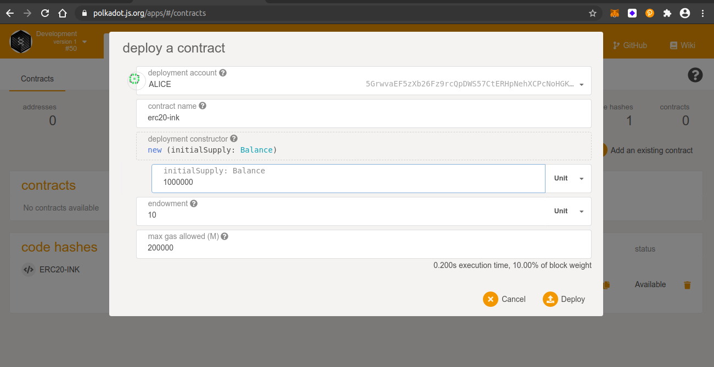
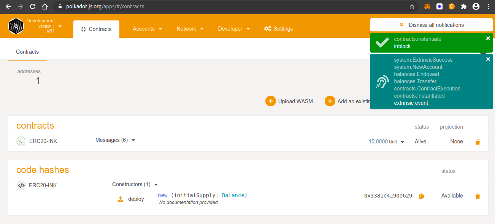
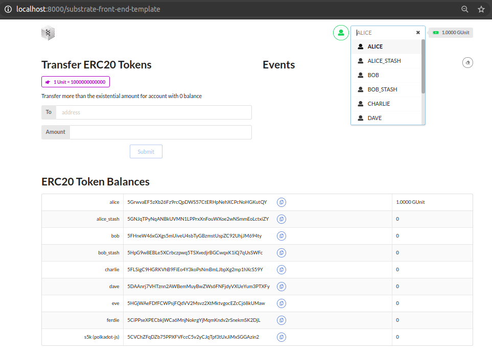
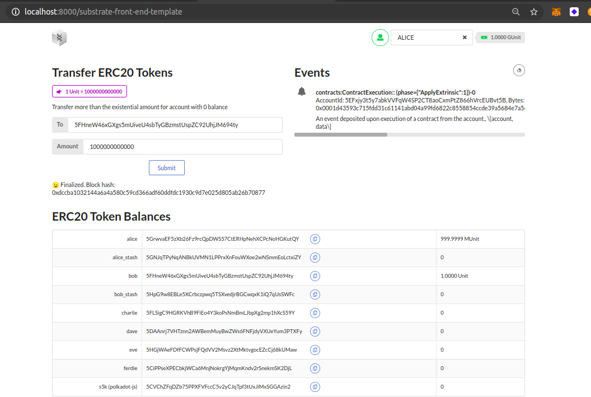

## Challenge description
#### [INTERMEDIATE CHALLENGE] Smart contracts - write an ERC-20 smart contract with ink!
<a href="https://substrate.dev/docs/en/tutorials/add-contracts-pallet/">Add the Contracts</a> pallet to the Node Template and write an ERC-20<a href="https://substrate.dev/docs/en/tutorials/add-contracts-pallet/"> smart contract in ink!</a>
### Submission requirements:
 > node source code link - <a href="https://github.com/s5k0651/hello-world-by-polkadot/tree/master/ERC20-smart-contract-with-ink/substrate-node-template"> Click here.</a>  
 > UI source code link - <a href="https://github.com/s5k0651/hello-world-by-polkadot/tree/master/ERC20-smart-contract-with-ink/substrate-front-end-template"> Click here.</a>

### upload wasm
  
### set initial supply
  
### deploy erc20 contract
  
### frontend
  
### transfer 1 Unit from Alice to Bob
  

