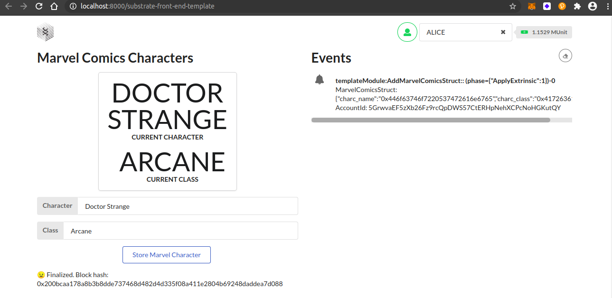
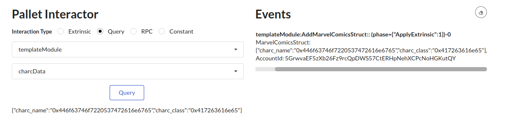

## Challenge description
#### [INTERMEDIATE CHALLENGE] FRAME Development
Update the <a href="https://github.com/substrate-developer-hub/substrate-pallet-template">Pallet Template</a> to include a <a href="https://substrate.dev/recipes/structs.html">storage item for a custom struct</a>. Add at least one dispatchable function to interact with the new storage item. <a href="https://polkadot.js.org/api/start/types.extend.html">Add the necessary types</a> to the <a href="https://github.com/substrate-developer-hub/substrate-front-end-template">Front-End Template</a> to interact with the new dispatchable.
### Submission requirements:
> Provide a link to a GitHub repository that includes the Node Template with the updated pallet as well as the updated front-end template. 

 [link to the GitHub repository](https://github.com/s5k0651/hello-world-by-polkadot/tree/master/FRAME-Development) 
 
### Store Custom Structure

### Query Data (Hexadecimal Format)

