## Challenge description
#### [INTERMEDIATE CHALLENGE] FRAME Multisig
Add the <a href="https://substrate.dev/rustdocs/v2.0.0-rc6/pallet_multisig/index.html">Multisig pallet</a> to the <a href="https://github.com/substrate-developer-hub/substrate-node-template">Node Template</a> and create a <a href="https://polkadot.js.org/api/start/">Polkadot-JS</a> script to make a multisig transaction. Use the <a href="https://github.com/substrate-developer-hub/substrate-front-end-template">Front-End Template</a> to create a multisig UI component.
### Submission requirements:
> Provide a link to your GitHub repository. 

 [link to the GitHub repository](https://github.com/s5k0651/hello-world-by-polkadot/tree/master/FRAME-Multisig) 
 [link to the Runtime](https://github.com/s5k0651/hello-world-by-polkadot/tree/master/FRAME-Multisig/substrate-node-template/runtime) 
 [link to the multisig UI component](https://github.com/s5k0651/hello-world-by-polkadot/blob/master/FRAME-Multisig/substrate-front-end-template/src/MultisigComponent.js) 
 [link to the Polkadot-JS script to make a multisig transaction](https://github.com/s5k0651/hello-world-by-polkadot/blob/master/FRAME-Multisig/substrate-front-end-template/src/Interactor.js)
 
 
### front-end call
 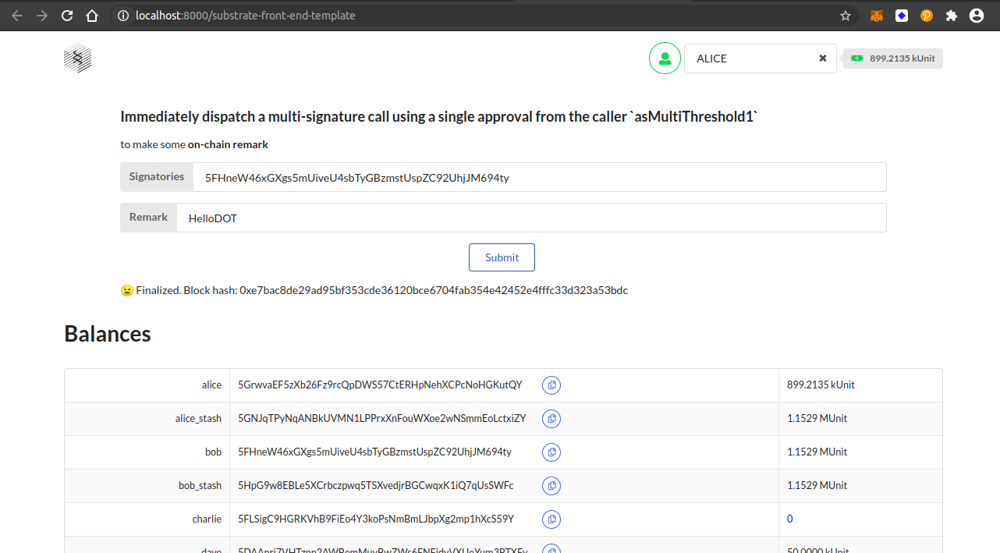
### finalized block hash
 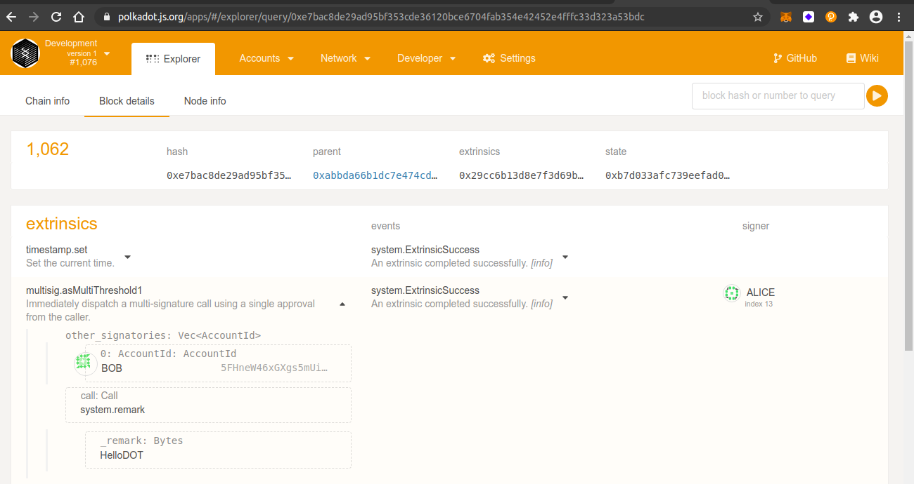
### multisig acc - USHA
 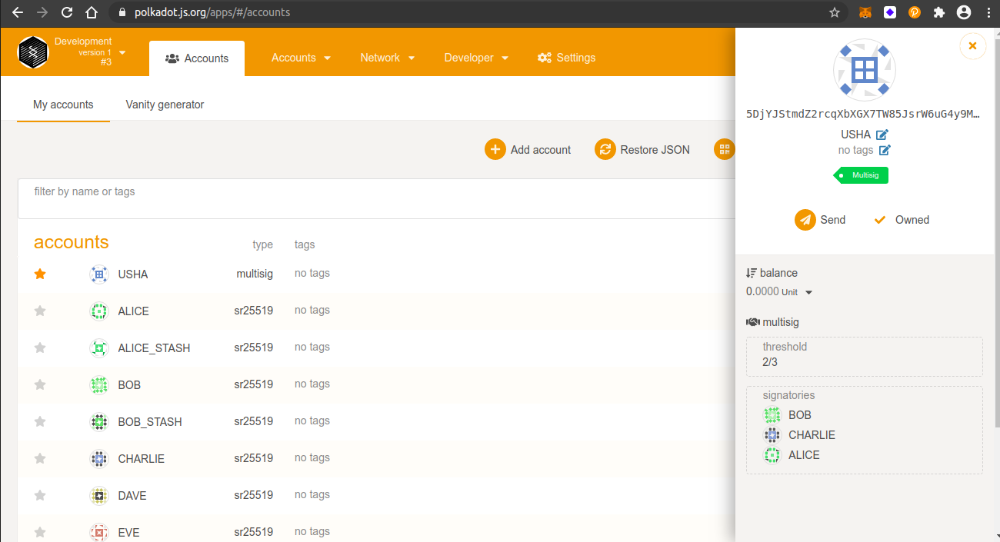
### transfere funds to the multisig ACC
 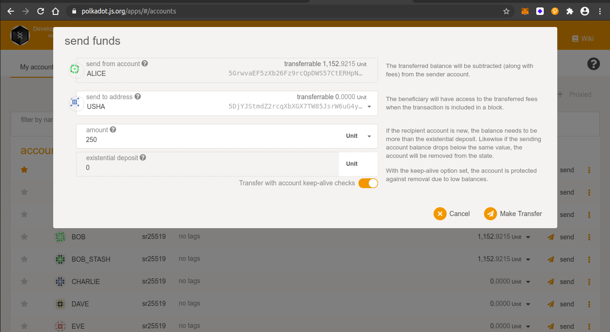
### updated balance for multisign ACC
 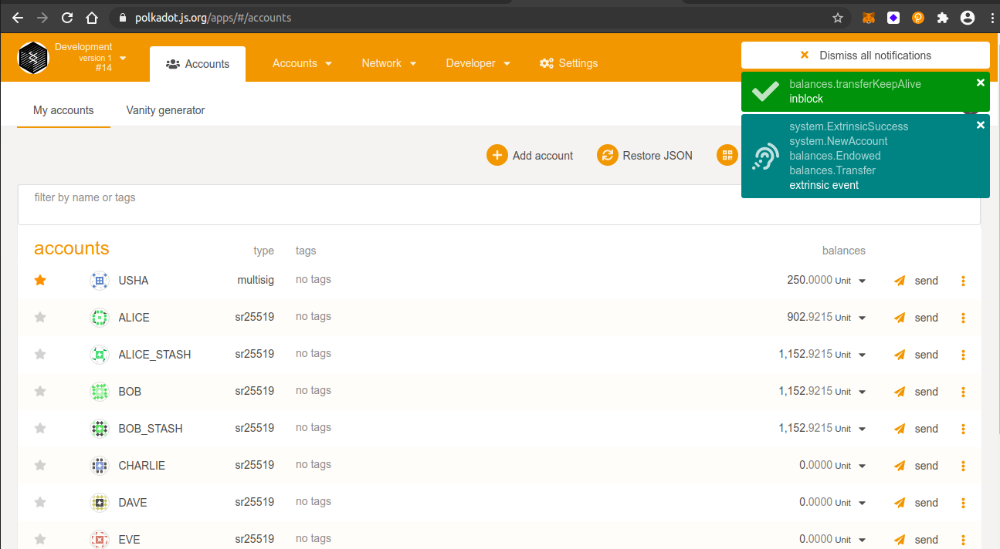
### transfer funds from multisig ACC
 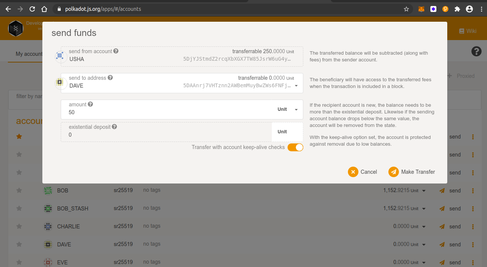
### first signature - ALICE
 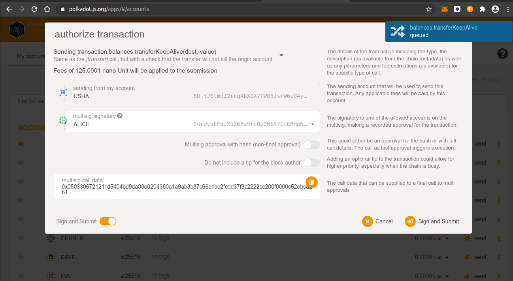
### New multisign event 
 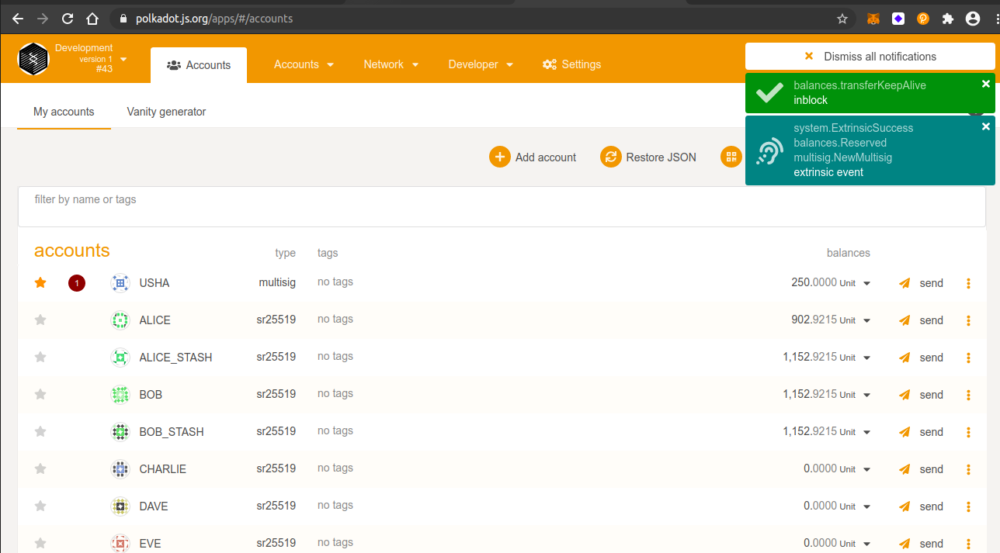
### second signature - CHARLIE
 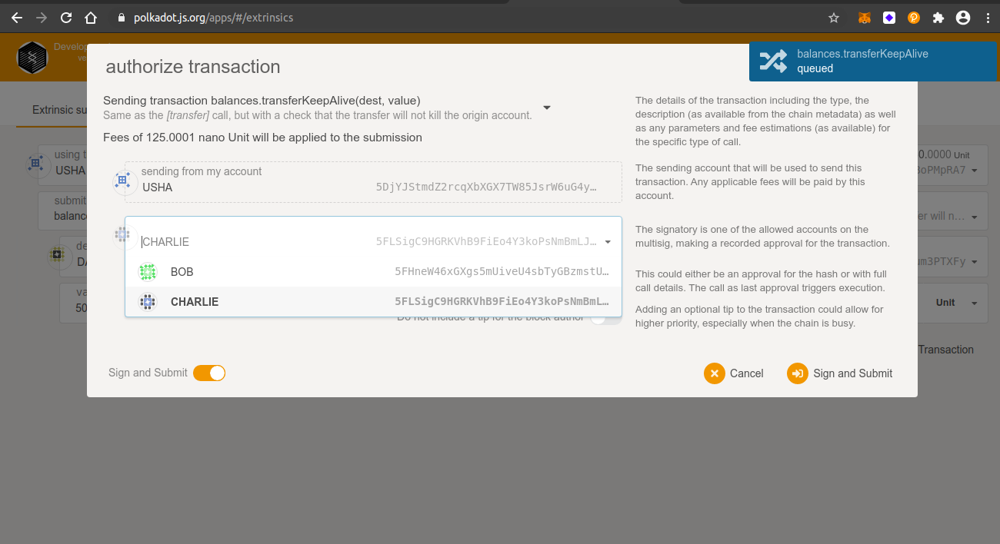
### transfer multisign event executed
 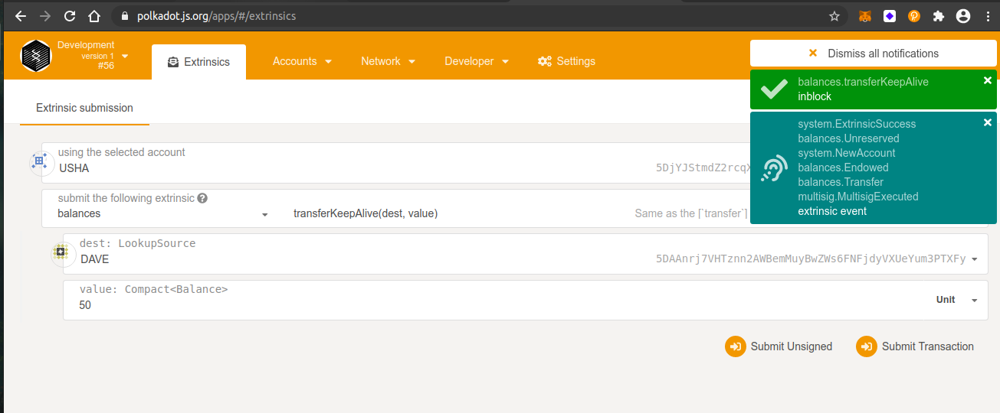
### updated balance of DAVE after 2-threshold signatories
 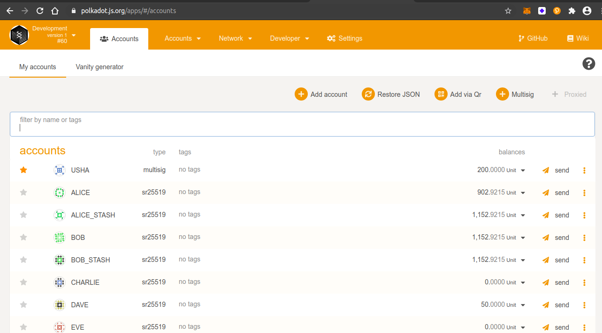
