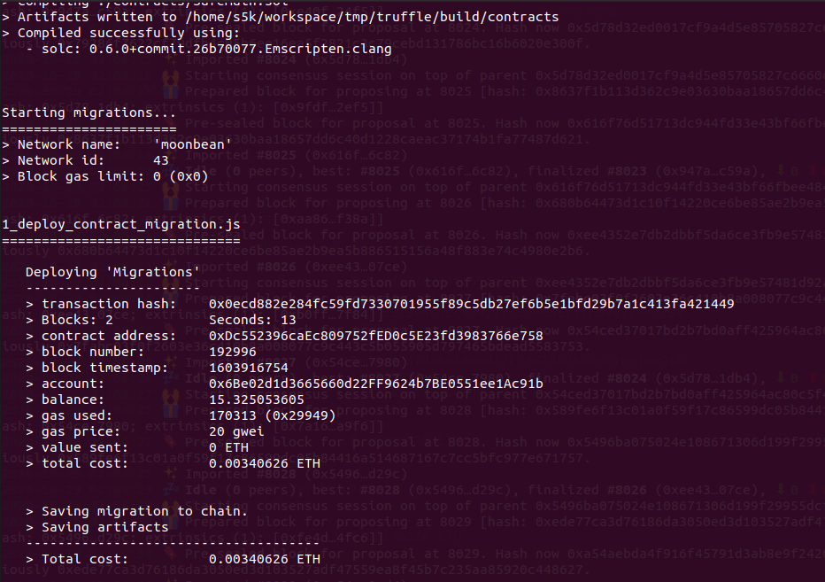

## Challenge description
This challenge focuses on using Truffle, a widely used developer tool in Ethereum, to deploy an ERC20 token contract to Moonbase Alpha (Moonbeam TestNet). The submitted result should be the address of the migrations contract (normally deployed by Truffle) and the address of the ERC20 token contract. Please submit them separated by a comma, that is: migrationsAddress,tokenAddress
 
### [ECOSYSTEM CHALLENGE] Deploy on Moonbase Alpha using Truffle

### Submission requirements:
  
0xDc552396caEc809752fED0c5E23fd3983766e758, 0xD81C7319c85fcd6e1F0893b3988BeBab6247Adbc
  
 

