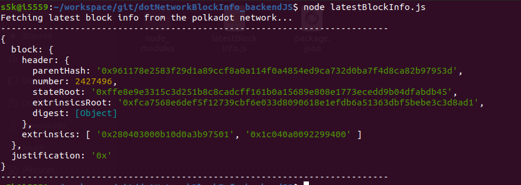

## Challenge description
#### [BEGINNER CHALLENGES] Back-End Javascript
Use <a href="https://polkadot.js.org/api/start/">Polkadot-JS</a> to write a command line utility that displays information about the latest block on Kusama, Polkadot or any other Substrate-based chain. Bonus: include an option to search for a block by number (height) and/or hash.
### Submission requirements:
 > Provide a link to your GitHub repository.
  [link to the GitHub repository](https://github.com/s5k0651/hello-world-by-polkadot/tree/master/dotNetworkBlockInfo_backendJS)  

