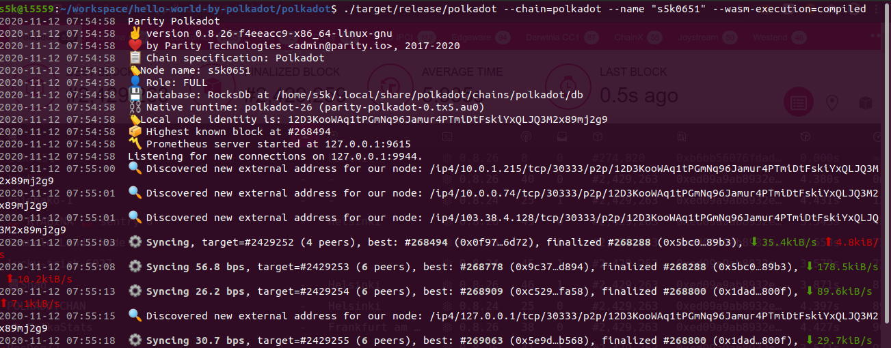
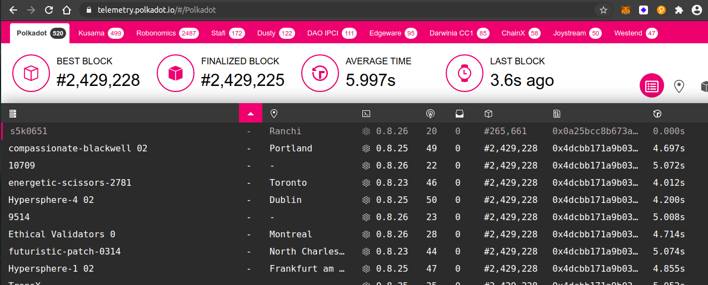
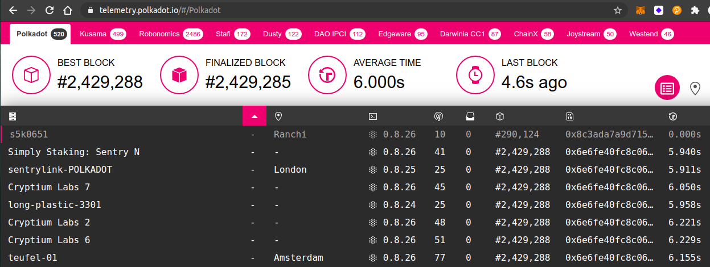

## Challenge description
### [BEGINNER CHALLENGE] Run A Kusama Or Polkadot Node And Add It To Telemetry
<a href="https://github.com/paritytech/polkadot/releases">Download the latest binary release</a> or build Polkadot or Kusama from source, and run your node. Add it to telemetry as per the README instructions, and let us know when your node appears in the <a href="http://telemetry.polkadot.io">telemetry.polkadot.io</a> list!
### Submission requirements:
> Node has to be on telemetry, fully synced, for at least 24 hours. The syncing will take a while, so be patient. Pro tip: run it with the --wasm-execution=compiled flag to quadruple sync speed! 

#### Polkadot Node (node name : s5k0651)

#### Node Telemetry (synced till block #265661) (node name : s5k0651)

#### Node Telemetry (synced till block #290124) (node name : s5k0651)

#### Note
**It will take at least a day to get fully synced. 😃**
