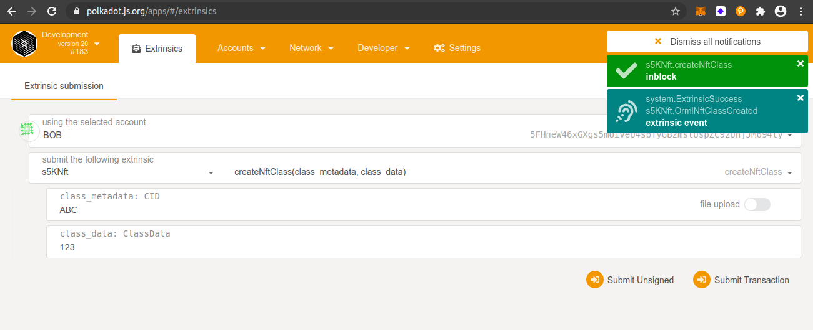
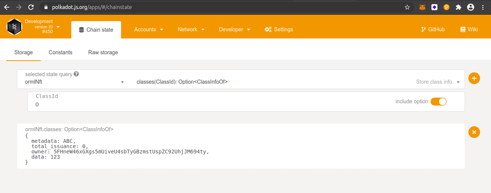
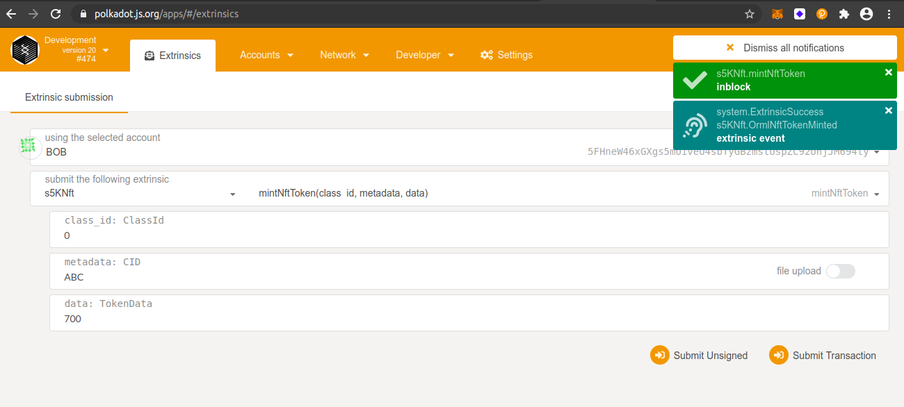
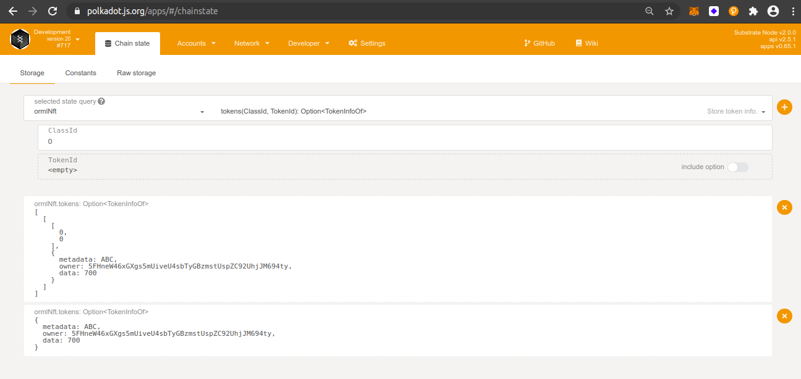
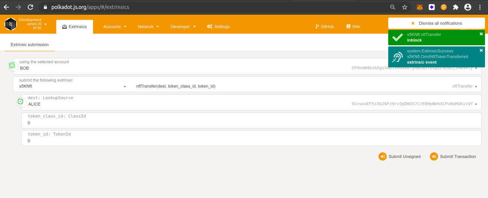
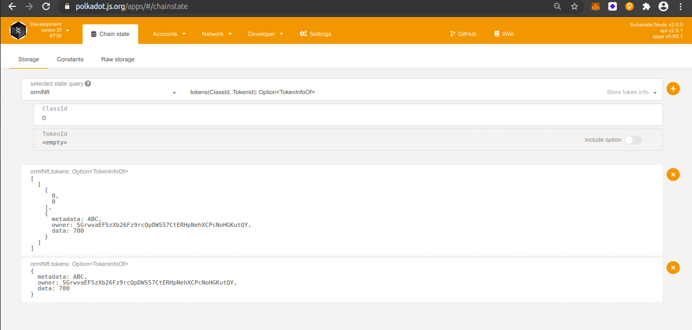

## Challenge description
Substrate by default only supports a single fungible token. We've developed an open runtime module library specifically orml-nft pallet to support Non Fungible Tokens. Simply add this into your runtime to enable NFT support, and start minting NFTs 🔥
 
### [ECOSYSTEM CHALLENGE] Enable NFT Support

### Submission requirements:
> Submit the runtime including the orml-nft pallet, bonus is to add and issue your own NFT token.
  
**substrate-node-template contains the modified substrate node with orml-nft pallet.** 
> Runtime: <a href = "https://github.com/s5k0651/hello-world-by-polkadot/tree/master/enable-NFT-support/substrate-node-template/runtime"> Click here to see the runtime including the orml-nft pallet </a>
  
### Create NFT Class
 
### Query NFT Class
 
### Mint NFT (Bob)
 
### Query NFT (Owner_Bob)
 
### Transfer NFT (Bob --> Alice)
 
### Query NFT (Owner_Alice)
 

