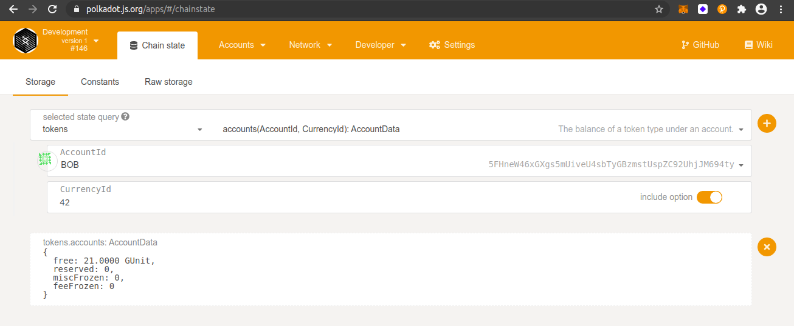
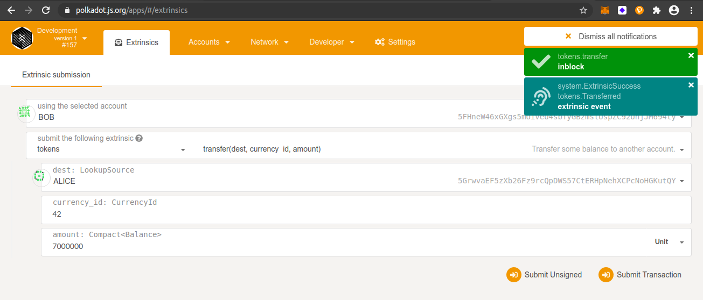
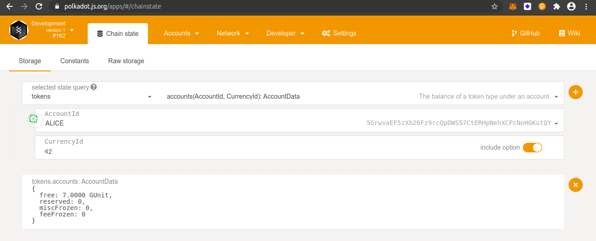

## Challenge description
Substrate by default only supports a single token. We've developed an open runtime module library specifically orml-token pallet to support multiple tokens. For example, on Acala via this pallet, we can support aUSD (Acala Dollar stablecoin), DOT/KSM, renBTC, PolkaBTC and various other assets. Simply add this into your runtime to enable multi-currency support and starting minting your own tokens. 🔥
 
### [ECOSYSTEM CHALLENGE] Enable Multi-currency Support

### Submission requirements:
> Submit the runtime including the orml-token pallet, bonus is to add and issue your custom token.
  
**substrate-node-template contains the code for the modified substrate node with the orml-tokens pallet.** 
> Runtime: <a href = "https://github.com/s5k0651/hello-world-by-polkadot/tree/master/enable-multi-currency-support/substrate-node-template/runtime"> Click here to see the runtime including the orml-token pallet </a>
  
### mint token
 
### token query Bob
 
### token transfer Bob
 
### token query Alice
 
