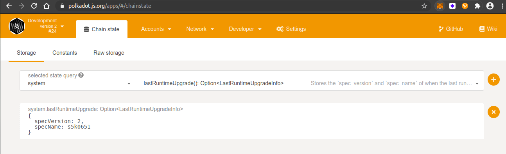

## Challenge description
### [INTERMEDIATE CHALLENGE] Forkless Upgrades
Perform a <a href="https://substrate.dev/docs/en/tutorials/upgrade-a-chain/">forkless runtime upgrade</a> on a local development chain.
### Submission requirements:
 > Provide a screenshot that shows the new spec_name and a spec version that is greater than 1, and update the <a href="https://substrate.dev/rustdocs/v2.0.0/sc_cli/struct.RuntimeVersion.html#structfield.spec_name">spec_name</a> in <a href="https://github.com/substrate-developer-hub/substrate-node-template/blob/v2.0.0/runtime/src/lib.rs#L94">runtime/src/lib.rs</a> from “node-template” to your GitHub username.</a> 

### Upgrade Info
 
