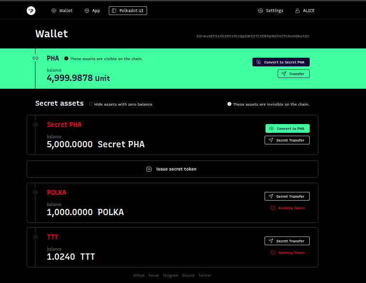
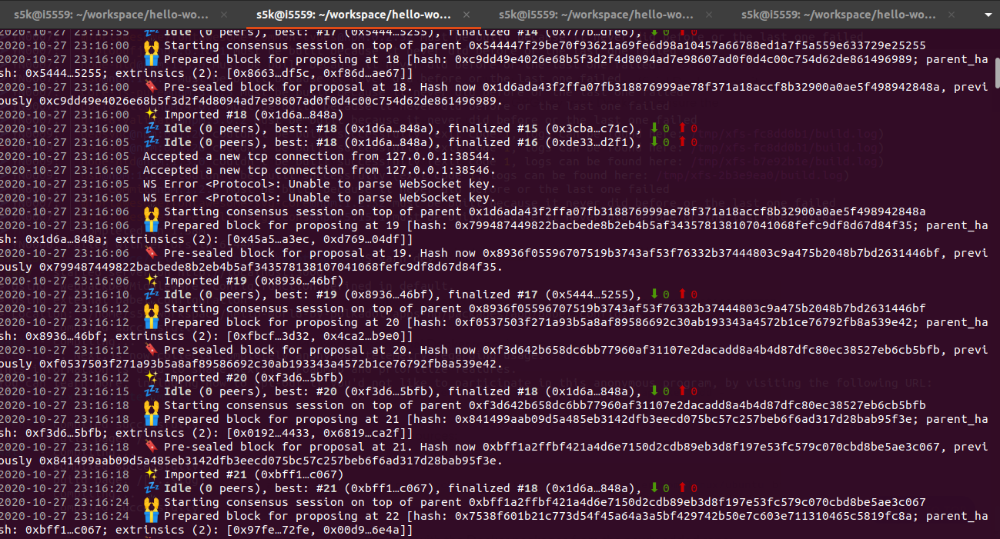
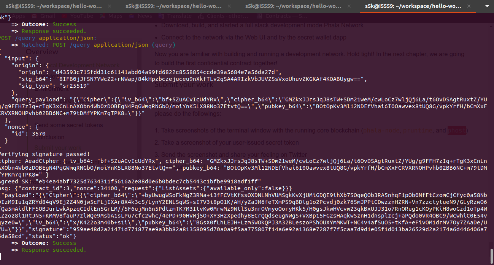
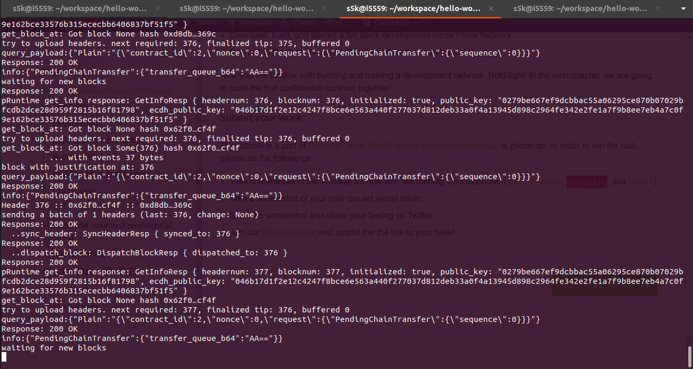

## Challenge description
In this challenge, you are going to set up a Phala Network "Hello World" development environment, 
and deploy a full stack of the core blockchain and connect the Web UI to the blockchain.
You will try the privacy-preserving “secret tokens” feature on your own local testnet.

### Build And Run A Local Phala Network

### Submission requirements:
  > Take a screenshot of your user-issued secret token.
  > Take screenshots of the terminal window with the running core blockchain (phala-node, pruntime, and phost).
  > Send the screenshot and share your feeling on Twitter.

### user issued secret token

### phala node

### phost

### pruntime

  [Click to see my tweet](https://twitter.com/s5k361996/status/1321165480401408000).

