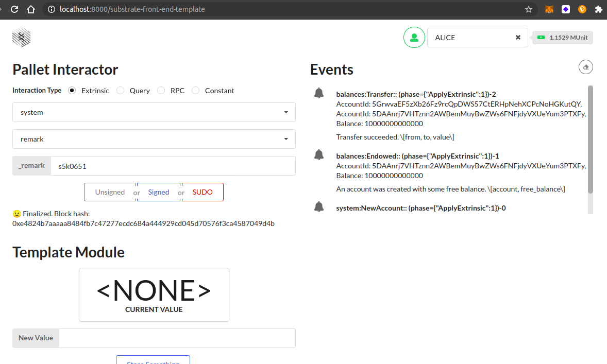

## Challenge description
#### [BEGINNER CHALLENGE] Launch A Local Substrate Development Chain
Use the Substrate<a href="https://github.com/substrate-developer-hub/substrate-node-template"> Node Template</a> to<a href="https://substrate.dev/docs/en/tutorials/create-your-first-substrate-chain/"> launch a local development chain</a> and use the<a href="https://github.com/substrate-developer-hub/substrate-front-end-template"> Front-End Template</a> to make a balance transfer and make an<a href="https://substrate.dev/rustdocs/v2.0.0-rc6/frame_system/enum.Call.html#variant.remark"> on-chain remark</a> with your GitHub username.

### Submission requirements:
Provide a screenshot that shows the finalized transaction.
  

  

