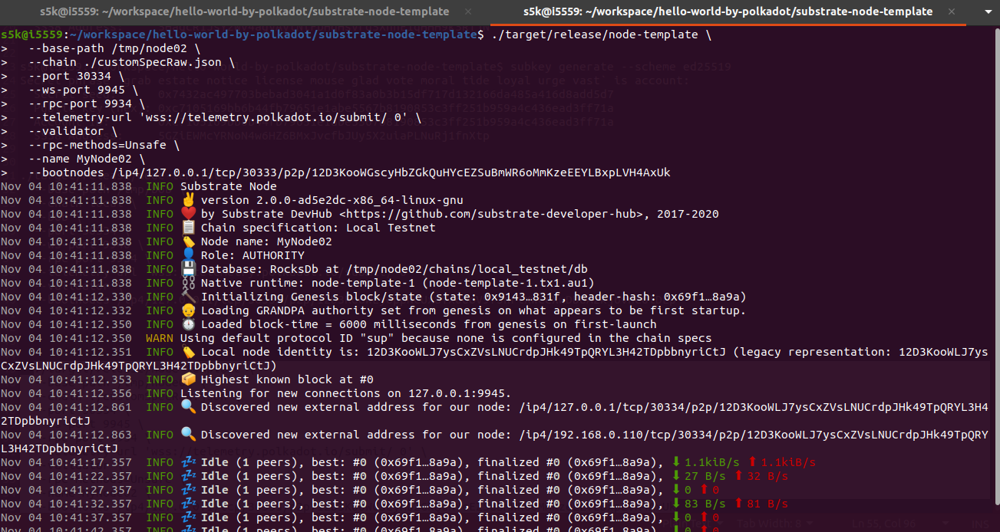

## Challenge description
Use Substrate to run a private local network.
 
### [BEGINNER CHALLENGE] Run A Private Substrate Network

### Submission requirements:
Provide a screenshot that shows restarting the second node after adding the keys. The screenshot should show the command that you used to start the node as well as a log line that shows that the network is finalizing blocks.
  

