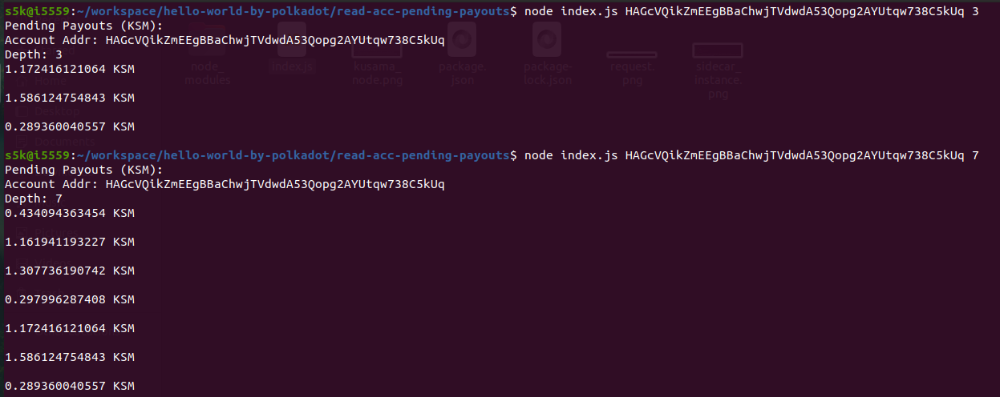
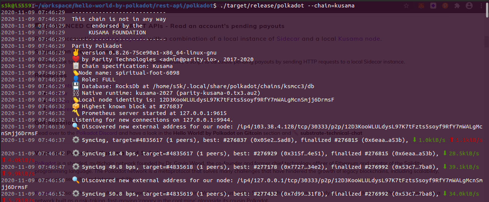
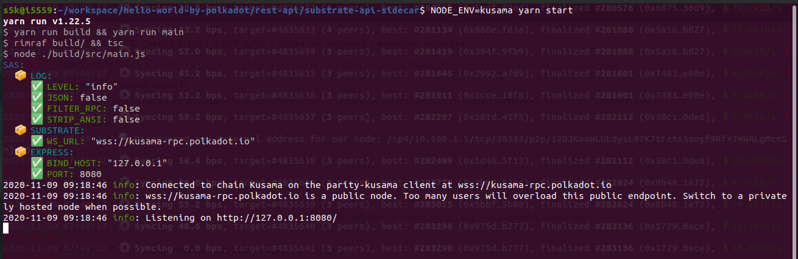

## Challenge description
####  [ADVANCED CHALLENGE] REST APIs - Read an account's pending payouts
Read an account's <a href="https://github.com/paritytech/substrate-api-sidecar/blob/master/src/controllers/accounts/AccountsStakingPayoutsController.ts">pending payouts</a> with a combination of a local instance of <a href="https://github.com/paritytech/substrate-api-sidecar">Sidecar</a> and a local <a href="https://github.com/paritytech/polkadot">Kusama node</a>.
### Submission requirements:
 > Provide a link to a Gist or Github repository that demonstrates a script to calculate pending payouts by sending HTTP requests to a local Sidecar instance.</a><br/><br/>
 > [link to the GitHub repository](https://github.com/s5k0651/hello-world-by-polkadot/blob/master/read-acc-pending-payouts/index.js)</br>

### Clone the polkadot repository
 > [polkadot-node](https://github.com/paritytech/polkadot)
``` 
./scripts/init.sh
cargo build --release
```
 > Connect to the global Kusama canary network by running:
```
./target/release/polkadot --chain=kusama
```

### Clone the sidecar instance
 > [sidecar-instance](https://github.com/paritytech/substrate-api-sidecar.git)</br>
 > Create .env.kusama file with SAS_SUBSTRATE_WS_URL=wss://kusama-rpc.polkadot.io within this directory.</br>
 > Run the service with:
```
NODE_ENV=kusama yarn start
```

### Get any validator address from <a href="https://kusama.subscan.io/validator/"> here </a> to check its pending payouts with :
```
node index.js [address] [depth]
```
### Pending Payout Request
<br/>
### POLKADOT - Kusama chain
<br/>
### Sidecar Instance
<br/>
