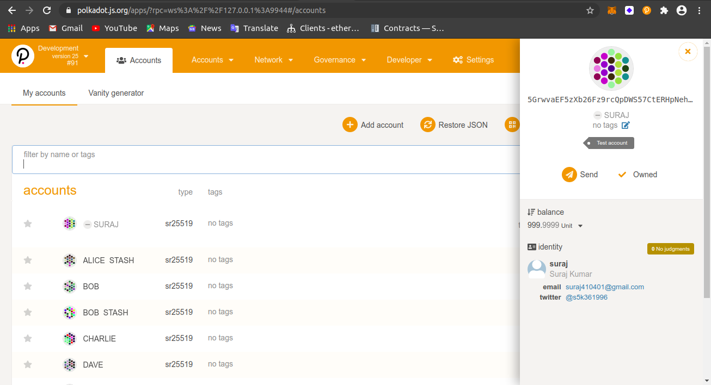

## Challenge description
Register an account’s identity on your local node-template chain. Add as many fields as you want, but at least one. See resources for a full guide on how to do this on a chain which supports setting identities. Once you’ve done this, send us a screenshot of that identity visible in Polkadot JS Apps connected to your local chain. Important: Make sure the fields clearly show a value through which we can contact you. E.g. the twitter field should have a valid twitter username, or the email field should have a valid email. We’ll use this to get in touch with you, so if you don’t have this info in your account’s identity, we can’t verify the completion of the task!

### [INTERMEDIATE CHALLENGE] FRAME Identity: Set an identity on a local --dev chain

### Submission requirements:

