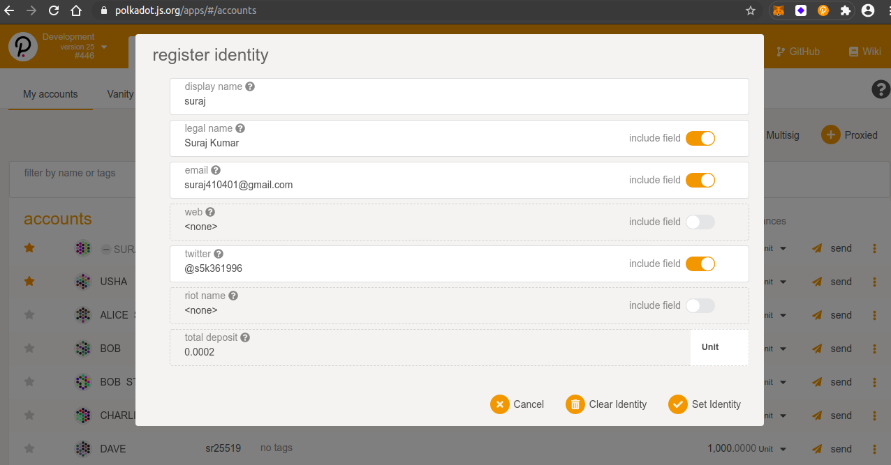
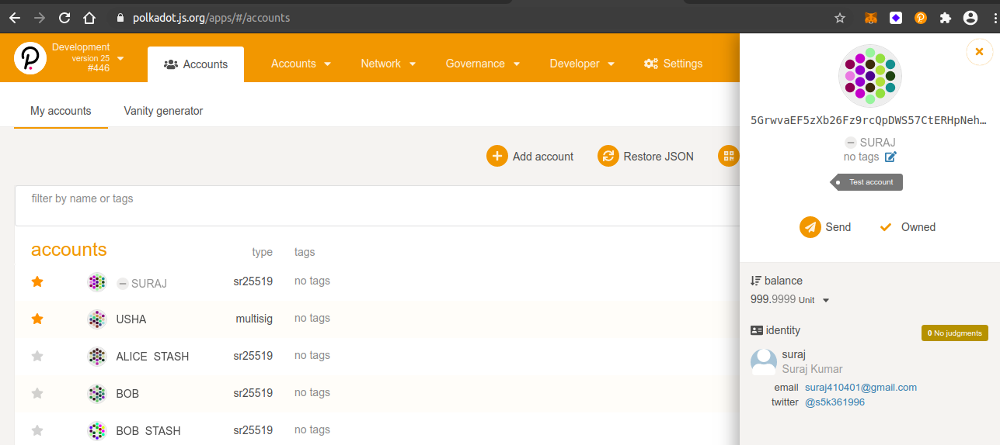
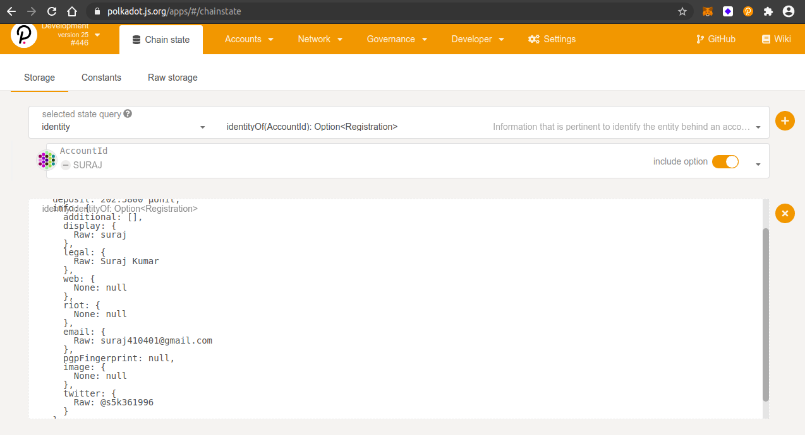
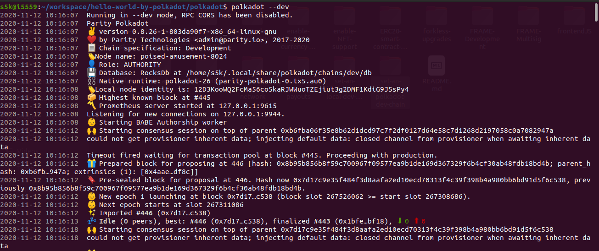

## Challenge description
### [BEGINNER CHALLENGE] Set an identity on Kusama or Polkadot's development version
Substrate-based chains which implement the Identities pallet let users of the chain set some on-chain metadata through which to identify their accounts. Kusama and Polkadot come with identities built in, but on node-template you’d have to manually extend the chain. This challenge takes the easier route: run the --dev version of Kusama or Polkadot, and register an identity on it. 

### Submission requirements:
 > Download (or build from source) and run a local version of Kusama or Polkadot, and register an account’s identity on it. As many fields as you want, but at least one. See resources for a full guide on how to do this on a chain which supports setting identities. Once you’ve done this, send us a screenshot of that identity visible in Polkadot JS Apps connected to your local chain. Important: Make sure the fields clearly show a value through which we can contact you. E.g. the twitter field should have a valid twitter username, or the email field should have a valid email. We’ll use this to get in touch with you, so if you don’t have this info in your account’s identity, we can’t verify the completion of the task!  

### Register Identity
 
### SURAJ's acc Identity
 
### Query acc's Identity
 
### Polkadot development chain

